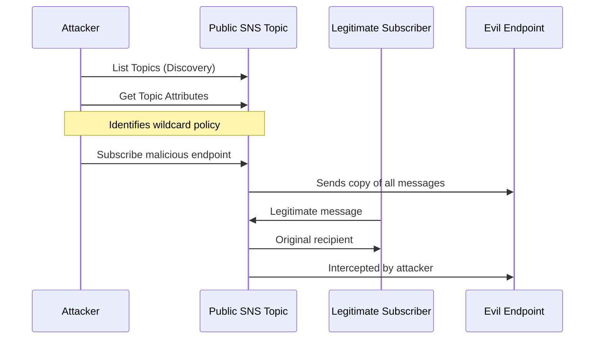

# Infrastructure Misconfigurations Analysis

## Overview

This document provides a comprehensive analysis of the security misconfigurations intentionally deployed in our SESNSploit test infrastructure. These misconfigurations are designed to simulate real-world AWS SNS and SES security issues that red teams and security assessors might encounter in production environments.

## Infrastructure Architecture and Attack Surface

```mermaid
graph TB
    %% Main Infrastructure Components
    subgraph "Primary Region (us-east-1)"
        subgraph "SNS Infrastructure"
            SNS1[SNS Topic: notifications]
            SNS2[SNS Topic: alerts] 
            SNS3[SNS Topic: admin]
            SNS4[SNS Topic: public - VULNERABLE]
            
            %% Policies
            SNS1 --> POLICY1[Secure Policy<br/>Account-only access]
            SNS2 --> POLICY2[Default Policy]
            SNS3 --> POLICY3[Default Policy<br/>Sensitive tag]
            SNS4 --> POLICY4[🚨 PUBLIC ACCESS POLICY<br/>Principal: '*'<br/>Actions: Subscribe, Publish, Receive]
        end
        
        subgraph "SES Infrastructure"
            SES1[Email Identity: hi@harekrishnarai.me]
            SES2[Email Identity: hello@harekrishnarai.me]
            SES3[Domain Identity: harekrishnarai.me]
            SES4[Configuration Set]
            SES5[Email Template]
            SES6[Receipt Rule Set]
        end
        
        subgraph "Supporting Services"
            SQS1[SQS Queue: test-queue]
            S3_1[S3 Bucket: ses-storage]
            LAMBDA1[Lambda: sns-processor]
        end
        
        subgraph "IAM Roles - OVERPRIVILEGED"
            IAM1[🚨 SNS Test Role<br/>sns:* on all resources]
            IAM2[🚨 SES Test Role<br/>ses:* on all resources]
            IAM3[🚨 Combined Role<br/>sns:*, ses:*, sqs:*, s3:*]
        end
    end
    
    subgraph "Multi-Region Resources"
        subgraph "us-west-2"
            SNS_W[SNS Topic: west]
        end
        
        subgraph "eu-west-1"
            SNS_E[SNS Topic: eu]
        end
    end
    
    %% Subscriptions and Connections
    SNS1 --> SQS1
    SNS1 --> LAMBDA1
    
    %% Vulnerable connections
    SNS4 -.->|Public Access| ATTACKER[🔴 Potential Attacker<br/>Can subscribe any endpoint]
    
    %% IAM Role Access
    IAM1 -.->|Excessive Access| SNS1
    IAM1 -.->|Excessive Access| SNS2
    IAM1 -.->|Excessive Access| SNS3
    IAM1 -.->|Excessive Access| SNS4
    
    IAM2 -.->|Excessive Access| SES1
    IAM2 -.->|Excessive Access| SES2
    IAM2 -.->|Excessive Access| SES3
    
    IAM3 -.->|Full Access| SNS1
    IAM3 -.->|Full Access| SES1
    IAM3 -.->|Full Access| S3_1
    
    %% Cross-Region Access
    IAM1 -.->|Cross-Region Access| SNS_W
    IAM1 -.->|Cross-Region Access| SNS_E
    
    %% Attack Vectors
    ATTACKER -.->|Topic Hijacking| SNS4
    ATTACKER -.->|Message Injection| SNS4
    ATTACKER -.->|Information Disclosure| SNS4
    
    %% Styling
    classDef vulnerable fill:#ff6b6b,stroke:#d63031,stroke-width:3px,color:#fff
    classDef secure fill:#00b894,stroke:#00a085,stroke-width:2px,color:#fff
    classDef warning fill:#fdcb6e,stroke:#e17055,stroke-width:2px,color:#2d3436
    classDef attacker fill:#d63031,stroke:#74b9ff,stroke-width:3px,color:#fff
    
    class SNS4,POLICY4,IAM1,IAM2,IAM3 vulnerable
    class SNS1,POLICY1 secure
    class SNS2,SNS3,POLICY2,POLICY3 warning
    class ATTACKER attacker
```



## Critical Misconfigurations Identified

### 🚨 High Severity Issues

#### 1. SNS Topic with Public Access Policy
- **Resource**: `${environment}-public-${suffix}` SNS Topic
- **Issue**: Policy allows `Principal: "*"` with full SNS permissions
- **Impact**: Any AWS account can subscribe to the topic and receive sensitive notifications
- **Exploitation**: Attackers can create unauthorized subscriptions to intercept messages

```json
{
  "Version": "2012-10-17",
  "Statement": [
    {
      "Sid": "AllowPublicAccess",
      "Effect": "Allow",
      "Principal": "*",  // ❌ DANGEROUS
      "Action": [
        "sns:Subscribe",   // ❌ Allows unauthorized subscriptions
        "sns:Publish",     // ❌ Allows message injection
        "sns:Receive"      // ❌ Allows message interception
      ],
      "Resource": "arn:aws:sns:*:*:sesnsloit-test-public-*"
    }
  ]
}
```

#### 2. Overprivileged IAM Roles

**Combined Test Role - Excessive Permissions**
- **Issue**: Wildcard permissions on critical services
- **Policy**: `sns:*`, `ses:*`, `sqs:*`, `s3:*` on all resources
- **Impact**: Complete control over messaging infrastructure

```json
{
  "Effect": "Allow",
  "Action": [
    "sns:*",     // ❌ Full SNS access
    "ses:*",     // ❌ Full SES access  
    "sqs:*",     // ❌ Full SQS access
    "s3:*"       // ❌ Full S3 access
  ],
  "Resource": "*"  // ❌ All resources
}
```

**SNS/SES Specific Roles**
- **Issue**: Service-wide wildcard permissions instead of resource-specific
- **Impact**: Access to all SNS topics and SES identities across regions

### ⚠️ Medium Severity Issues

#### 3. Default SNS Topic Policies
- **Resources**: `alerts` and `admin` topics
- **Issue**: No explicit access restrictions beyond account boundaries
- **Risk**: Potential for privilege escalation within the account

#### 4. Cross-Region Resource Access
- **Issue**: IAM roles can access resources across all regions
- **Risk**: Expanded attack surface for lateral movement

#### 5. Sensitive Resource Tagging
- **Resource**: Admin SNS topic tagged with `Sensitive: "true"`
- **Issue**: Tags may reveal sensitive resources to attackers
- **Risk**: Information disclosure about critical infrastructure

### 🔍 Information Disclosure Issues

#### 6. Predictable Resource Naming
- **Pattern**: `${environment}-${purpose}-${random_suffix}`
- **Issue**: Naming pattern makes resource discovery easier
- **Risk**: Enumeration and reconnaissance

#### 7. Comprehensive Output Information
- **Issue**: Terraform outputs expose detailed infrastructure information
- **Risk**: Information useful for attackers is readily available

## Attack Scenario Mapping

### Attack 1: SNS Topic Hijacking
**Target**: Public SNS topic with wildcard permissions
**Method**: 
1. Discover public topic via enumeration
2. Subscribe malicious endpoint
3. Intercept or inject messages



### Attack 2: SES Identity Spoofing
**Target**: SES identities with broad permissions
**Method**:
1. Enumerate SES identities
2. Attempt to verify new similar identities
3. Send spoofed emails

### Attack 3: Cross-Service Privilege Escalation
**Target**: Overprivileged IAM roles
**Method**:
1. Assume role with limited intended scope
2. Exploit wildcard permissions
3. Access unintended resources

### Attack 4: Lateral Movement
**Target**: Cross-region resources
**Method**:
1. Compromise resources in one region
2. Use same IAM roles for cross-region access
3. Expand attack scope geographically

## Detection and Monitoring Gaps

### 1. Missing CloudTrail Monitoring
- No specific monitoring for SNS subscription changes
- No alerting on cross-region SES/SNS access

### 2. Insufficient IAM Monitoring
- No detection of role assumption patterns
- No monitoring of wildcard permission usage

### 3. Resource Access Logging
- No S3 access logging for SES storage bucket
- No CloudWatch metrics for suspicious SNS activity

## Remediation Recommendations

### Immediate Actions Required

#### 1. Fix SNS Public Access Policy
```json
{
  "Version": "2012-10-17",
  "Statement": [
    {
      "Sid": "AllowAccountAccess",
      "Effect": "Allow",
      "Principal": {
        "AWS": "arn:aws:iam::ACCOUNT-ID:root"
      },
      "Action": [
        "sns:Subscribe",
        "sns:Publish",
        "sns:Receive"
      ],
      "Resource": "arn:aws:sns:*:*:topic-name",
      "Condition": {
        "StringEquals": {
          "aws:SourceAccount": "ACCOUNT-ID"
        }
      }
    }
  ]
}
```

#### 2. Implement Least Privilege IAM
```json
{
  "Effect": "Allow",
  "Action": [
    "sns:GetTopicAttributes",
    "sns:ListSubscriptionsByTopic"
  ],
  "Resource": [
    "arn:aws:sns:us-east-1:ACCOUNT:specific-topic-*"
  ]
}
```

#### 3. Add Resource-Specific Conditions
- Implement source IP restrictions
- Add time-based access controls
- Require MFA for sensitive operations

### Long-term Security Improvements

#### 1. Implement Monitoring
- CloudTrail for all SNS/SES API calls
- CloudWatch alarms for unusual activity
- AWS Config rules for policy compliance

#### 2. Network Segmentation
- VPC endpoints for SNS/SES access
- Private subnets for sensitive resources
- Security groups with minimal access

#### 3. Encryption and Data Protection
- Enable SNS message encryption
- Implement SES message encryption in transit
- Use KMS customer-managed keys

## Testing and Validation

### Using SESNSploit for Assessment

1. **Reconnaissance Phase**
```bash
python3 main.py
# Use options to enumerate all regions
# List all SNS topics and SES identities
# Check topic attributes and policies
```

2. **Exploitation Phase**
```bash
# Test public topic subscription
# Attempt cross-region access
# Try identity spoofing
```

3. **Impact Assessment**
```bash
# Monitor message interception
# Test message injection
# Validate privilege escalation
```

## Compliance and Regulatory Impact

### GDPR Implications
- Message interception could expose personal data
- Lack of encryption violates data protection requirements

### SOX Compliance
- Financial notifications could be intercepted
- Audit trail gaps in message handling

### Industry Standards
- Violates NIST Cybersecurity Framework controls
- Non-compliant with AWS Well-Architected Security Pillar

## Conclusion

This infrastructure intentionally implements multiple high-severity misconfigurations that mirror real-world security issues found in AWS environments. The combination of overprivileged IAM roles, public SNS policies, and lack of monitoring creates a comprehensive attack surface suitable for red team assessments and security training.

**Key Takeaways:**
1. Always implement least privilege access
2. Never use wildcard principals in resource policies
3. Implement comprehensive monitoring and alerting
4. Regular security assessments are critical
5. Cross-region considerations amplify security risks

This infrastructure serves as an excellent training ground for security professionals to understand and exploit common AWS messaging service misconfigurations while learning proper remediation techniques.
